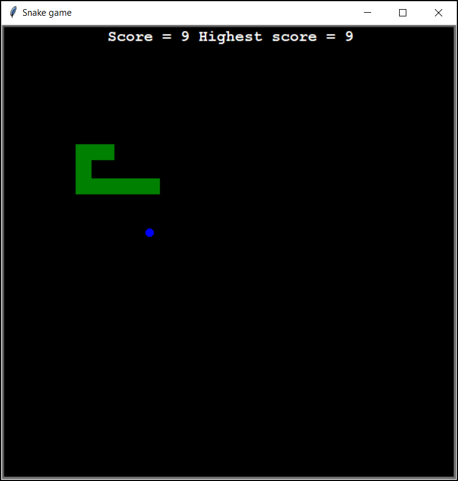
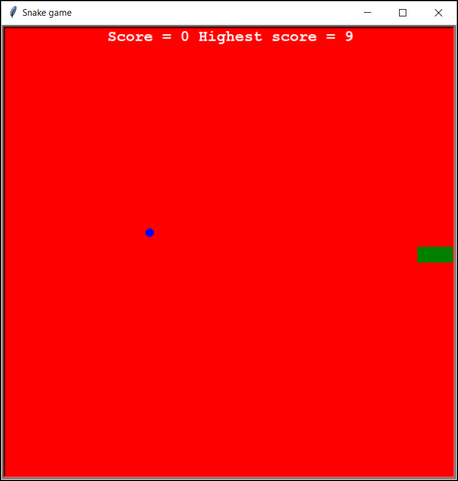
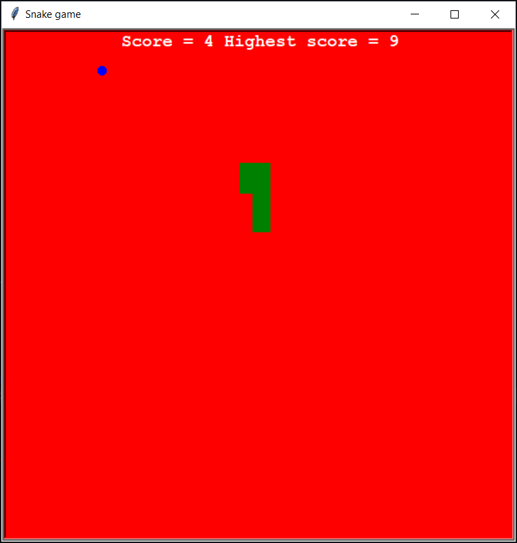

## Snake Game

The Snake Game is a simple yet addictive game where the player controls a snake to eat food and grow in length. The objective is to avoid colliding with the walls or the snake's own body. This implementation uses the Turtle graphics library in Python to create the game visuals.

<p align="center">
  
</p>

## Features

- Classic snake gameplay
- Increasing difficulty as the snake grows
- Simple and intuitive controls
- Score tracking
- Utilizes the Turtle graphics library for rendering

## Visual Effects

The game includes visual effects to enhance the player's experience. One notable effect is the background color change. When the snake collides with the wall or its own tail, the background color turns red, providing immediate visual feedback of the collision. This effect helps to make the game more engaging and visually appealing.

<p align="center">
  
</p>

<p align="center">
  
</p>

## Installation and Usage

To run the Snake Game locally, follow these steps:

1. Clone the repository to your local machine.
2. Navigate to the project directory:
  ```bash
  cd SnakeGame
  ```
3. Install the necessary dependencies:
  ```bash
  npm install
  ```
4. Start the game by running the following command:
  ```bash
  python main.py
  ```

Use the arrow keys to control the snake. Try to eat the food and grow as long as possible without hitting the walls or yourself!

## Project Structure

The project is composed of several classes that handle different aspects of the game:

- `Snake`: Manages the snake's position, movement, and growth.
- `Food`: Handles the spawning and positioning of food items.
- `Scoreboard`: Tracks and displays the player's score.

The `data.txt` file is used to store high scores and other persistent game data. It keeps track of the highest score achieved by the player, allowing the game to display the best score even after restarting. The file is read at the start of the game to load the previous high score and updated whenever the player achieves a new high score.

## Contributing

This project is open-source so feel free to fork this project and submit pull requests for improvements or new features. Suggestions or enhancements are always welcome!
